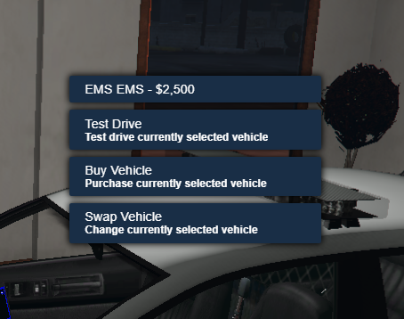
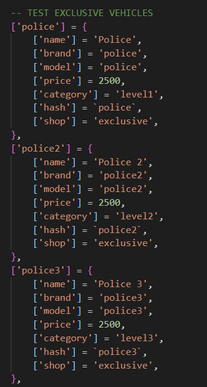

# Exclusive Vehicleshop [ Priority Based ]

This is a automatic priority vehicle dealership where you can put certains vehicles accessible to your server donators.

Two types of configurations:-

* SQL Based Priority
* Discord Based Priority

Three Priority Tiers Level 1 ,2 ,3

**Note:** You can add more level if you know how to edit lua or else join support to get help.

# 🚀️ Dependencies

* qb-core
* qb-menu
* PolyZone
* qb-target (optional)
* Breze Benefactor MLO (Credits Breze) ([Download](https://forum.cfx.re/t/mlo-benefactor-car-dealer-breze/1234653))
  **Note:** You can use your own mlo by just configuring the zones, coords in `shared.lua`

# 📸 Preview

Video: [Click Here](https://www.youtube.com/channel/UCdsjPthu924h8QUCTu3J5jQ)

---

# 🛈 Instructions

🗄️ **SQL Based Priority**

| Category | Priority  [VALUE IN SQL] | Priority Level | Can Buy |
| - | - | - | - |
| Level 1 | 1 | Bronze | Can Buy Level 1,2,3 |
| Level 2 | 2 | Silver | Can Buy Level 1,2 |
| Level 3 | 3 | Gold | Can Buy Level 1,2,3 |

- `/givepriority [id] [1-3]`
  `Here, [id] = Player In-game ID`&`[1-3]= Priority Level according to SQL value given in above table.`
- `Change Config.PriorityDiscord = false in shared.lua`

📣 **Discord Based Priority**

* `Configure Bot Token & Discord Server Id & Roles Name/ID in shared.lua`
* `Change Config.PriorityDiscord = true in shared.lua`

1. Add the **cad-xvehshop** folder to your FiveM resources directory.
2. Edit your **server.cfg** and add “ensure **cad-xvehshop**”
3. Run **xvehshop.sql**
4. Configure **shared.lua** according to your requirements. Dont Edit **server & client** scripts unless you know what your are doing
5. Start your Server and **Enjoy!**

# 🎚 Instructions to add vehicles (level wise)

* Add vehicles in `qb-core/shared/vehicles.lua`
* Set values for following as below:
  * `shop: 'exclusive'`
  * `category: 'level1', 'level2', 'level3' (any of your choice)`
    `Note: level1: bronze, level2: silver, level3: gold`

# 📨 Discord

Join Support: [Click Here](https://discord.gg/9tyjPkA6nd)
